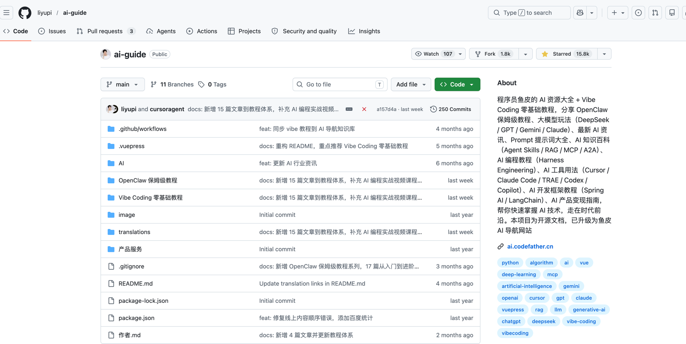

# github 加速
## 方法1
### 安装
通过插件 FastGithub 插件来加速 github 访问速度
```shell
git clone https://gitcode.com/gh_mirrors/fa/Fast-GitHub.git
cd Fast-GitHub
# 解压 zip 文件
cd zip
unzip v1.5.10.zip
```

### 加载插件
我是用的 qq 浏览器，所以进入扩展程序管理页面
1. 打开 QQ 浏览器，在地址栏输入 qqbrowser://extensions/ 或点击浏览器右上角菜单进入“扩展中心” -> “管理扩展”。

2. 开启开发者模式：
在扩展管理页面的右上角，找到并开启“开发者模式”开关。

3. 加载已解压的扩展程序
点击页面上出现的“加载已解压的扩展程序”按钮，在弹出的窗口中选择刚才解压好的 fast_github 文件夹。

4. 验证安装效果：
安装成功后，浏览器工具栏会出现该插件的图标。此时访问任意 GitHub 仓库页面，若图标亮起绿色，即表示加速功能已正常启用。


## 方法2
github 上的所有项目都会在 https://gitcode.com/ 存在对应的镜像项目，假如只是查看和下载 release 的包，那么可以从 gitcode.com 下载。以鱼皮的ai导航项目为例

在 github 地址 https://github.com/liyupi/ai-guide


在 gitcode 对应地址，先左侧导航到【首页】-》搜索框（正上方位置），输入 project name（比如 ai-guide）-》搜索

输入之后点击【搜索】就会看到对应的项目


点开之后，就进入到了对应的镜像项目
https://gitcode.com/GitHub_Trending/aig/ai-guide
