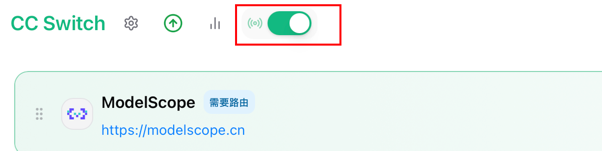
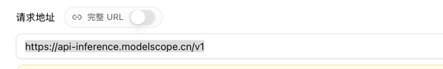
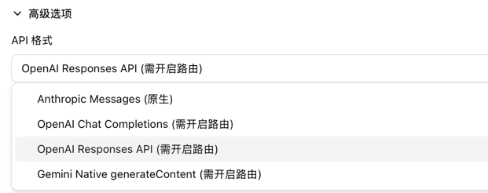
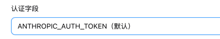

# 使用魔搭社区的模型
~/.claude/settings.json

# openai 接口类型
魔搭社区当前稳定（2026.5.31）接口协议还是 oneapi ，未来会支持 anthropic 接口协议（当前已经在 beta 版本中了），所以需要使用 cc-switch 来进行协议转换。

参考文档
https://modelscope.cn/docs/model-service/API-Inference/intro

## cc-switch 配置
1. 需要先开启 路由

2. baseUrl
https://api-inference.modelscope.cn/v1

3. api格式 

4. 认证字段

## 注意
1. 秘钥是完整的字符串，带有 ms- 前缀
2. ANTHROPIC_BASE_URL 需要带上后缀 `/v1` 
3. openai 有两种接口，Responses API 和 Chat Completion，这里需要用 Responses API